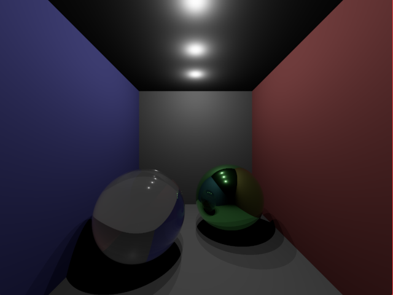
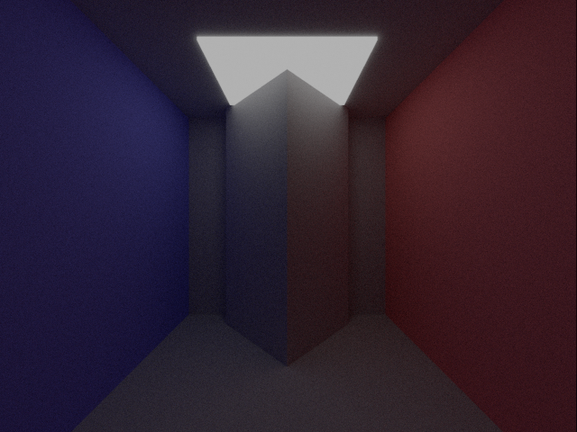
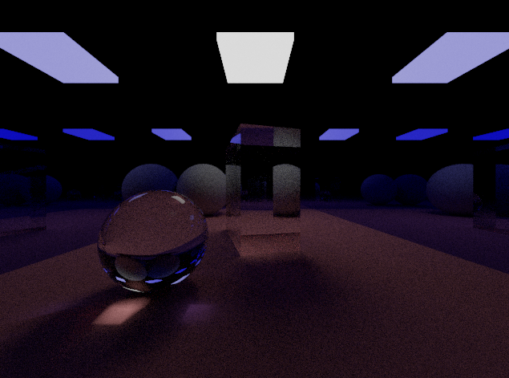

# Path Tracing
Path tracing to create photorealistic renderings of 3D scenes.

## Features
- Ray tracing with point sources of light
- Supported shapes: Cuboid, Plane, Sphere and their affine transformations
- Supported materials: 
    - Diffuse objects
    - Metals with specified reflectance
    - Transparent objects with specified refractive index
- Light transport effects:
    - Soft shadows
    - Recursive reflections and refractions
    - Total internal reflection
    - Indirect illumination 
    - Caustics

## Demo 





## Installation
1. Install required packages: `SDL2`, `SDL2 Image`, `OpenGL`, `GLEW`, `CMake`.
```
# Ubuntu
sudo apt-get install -y libsdl2-image-dev libglm-dev libglew-dev libopengl-dev cmake
```
2. Create `build` directory in the project root.
```
mkdir build
```
3. Build the project
```
cd build
cmake ..
make
```
4. Run any of the examples: `e1`, `e2`, `e3`, ...

